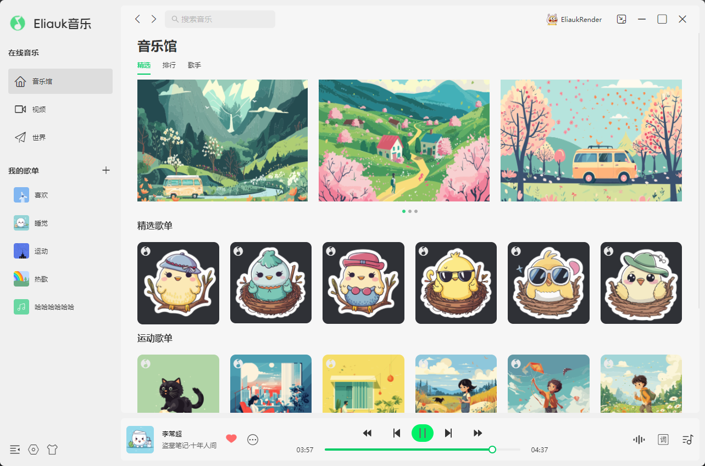

## APP功能说明与效果展示
### 已支持功能：
* 支持歌曲播放、暂停、上一曲、下一曲、快进、快退、歌曲循环模式、音量调节、双击切歌
* 支持新建歌单并添加歌曲；支持删除歌单
* 支持自定义频谱图颜色、形状
* 支持窗口最大、最小、全屏、双击最大、双击恢复
### 正在开发的功能：
* mini窗口的音乐控制
* mini窗口的歌词
* 在线音乐板块
### fix list
* bars在同时显示多个时有定时器问题


### 主页面

### 歌词页面

### 频谱图调节弹窗

### 歌曲播放队列弹窗


## 1、安装依赖
```
yarn install
```
**Having issues installing? See our [debugging guide](https://github.com/electron-react-boilerplate/electron-react-boilerplate/issues/400)**

### 问题汇总
node-gyp安装过程会偶现失败，尝试修改.npmrc配置文件  
``` 
electron_builder_binaries_mirror=https://npmmirror.com/mirrors/electron-builder-binaries/  
electron_mirror=https://cdn.npmmirror.com/binaries/electron/     
home=https://npmmirror.com     
registry=https://registry.npmmirror.com/
strict-ssl=false
```


## 2、开发调试
```
yarn start  #开发环境
```

## 3、构建打包
```
# 生产环境
# 打包之前请使用管理员身份打开编辑器再打包
yarn package 
```

## 4、常用指令
```bash
// 重置代理
git config --global --unset http.proxy
git config --global --unset https.proxy

// 配置代理
git config --global http.proxy 127.0.0.1:7890
git config --global https.proxy 127.0.0.1:7890
```
## 5、模板官方文档
https://electron-react-boilerplate.js.org/docs/installation
